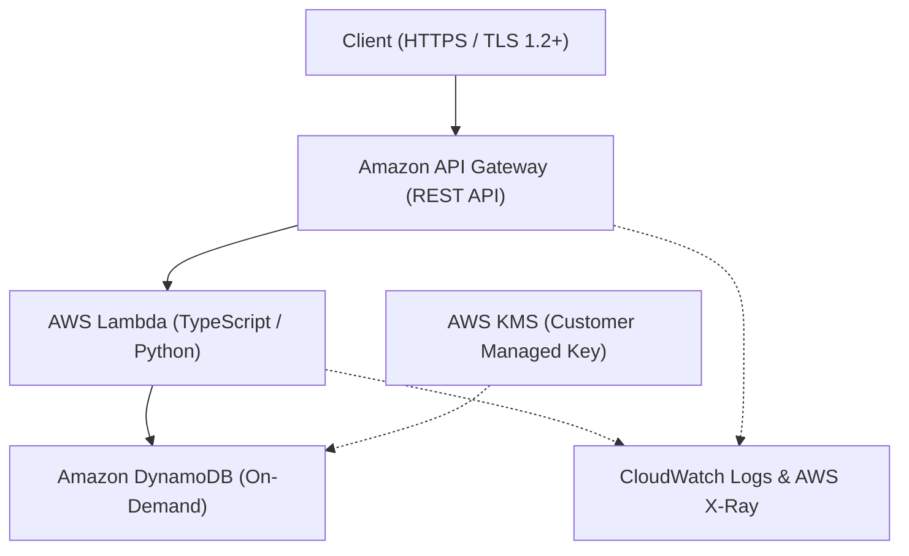

# Serverless API Dual IaC 基盤 🚀

> **Terraform × AWS CDK の二刀流アプローチで築く、堅牢・美麗な完全サーバーレス RESTful API アーキテクチャ**

---

## 🌟 プロジェクト概要

本プロジェクトは、AWS 上に構築された本番運用対応のサーバーレス RESTful API 基盤です。
ステートフルな永続化層と変化の速いアプリケーション結合層を論理的に分離し、**Terraform** と **AWS CDK** の強みを融合させた「ハイブリッド二刀流アーキテクチャ」を採用しています。

### 💡 インフラストラクチャのハイライト
- **完全マネージド & 高可用性**: Amazon API Gateway + AWS Lambda + Amazon DynamoDB の単一障害点（SPOF）フリー構成。
- **二刀流 IaC 戦略**: 
  - **Terraform**: 永続化データ層（DynamoDB, KMS, 共通IAM）を宣言的かつ堅牢にプロビジョニング。
  - **AWS CDK**: コンピュート＆エンドポイント層（Lambda, API Gateway）をコードファーストで迅速にデプロイ。
- **エンタープライズグレードの堅牢性**: TLS 1.2+ 強制、KMS カスタマーキーによる保管時暗号化、PITR（ポイントインタイムリカバリ）有効化、最小権限 IAM ロール設計。
- **フルスタック Observability**: 構造化ログ（CloudWatch Logs 30日保持）、分散トレーシング（AWS X-Ray）、および異常検知アラームを標準装備。

---

## 🏗️ システム構成図



---

## 📁 ディレクトリ構造

```text
.
├── iac/
│   ├── terraform/          # [Layer 1] ステートフル基盤 (DynamoDB, KMS, IAM Base)
│   │   ├── main.tf
│   │   ├── dynamodb.tf
│   │   ├── kms.tf
│   │   └── outputs.tf      # CDK等へ渡すリソース識別子のエクスポート
│   └── cdk/                # [Layer 2] アプリケーション結合層 (API Gateway, Lambda)
│       ├── bin/
│       │   └── app.ts
│       └── lib/
│           └── api-stack.ts
├── src/                    # Lambda アプリケーションコード
│   └── handlers/
│       └── index.ts
└── README.md
```

---

## 🚀 デプロイ手順

### 1. 前提条件
- AWS CLI (v2) 設定済み (`aws configure`)
- Terraform (>= 1.5.0)
- Node.js (>= 18.x) & npm
- AWS CDK CLI (`npm install -g aws-cdk`)

### 2. ステートフル層のデプロイ (Terraform)
```bash
cd iac/terraform
terraform init
terraform plan
terraform apply -auto-approve
```

### 3. アプリケーション・API層のデプロイ (AWS CDK)
```bash
cd ../cdk
npm install
cdk bootstrap
cdk deploy
```

---

## 🎬 キャスト & クレジット（AIアプリ工場劇場）

本リポジトリは、AIアプリ工場劇場のエージェントたちによる共創オーケストレーションによって誕生しました。

- **企画・要件定義**: agent🔵（堅牢かつ無駄のないミニマム二刀流アーキテクチャの青写真）
- **進行管理・レビュー**: agent🍇（アーキテクチャ全体の整合性担保とデザインディレクション）
- **インフラ・コード実装**: agent🍊（Terraform & CDK の爆速かつ高精度なデュアルコーディング）
- **品質保証・検証**: agent🟢（セキュリティ、暗号化、PITR、トレーシングの厳密チェック）
- **総合プロデュース**: agent🟡（リポジトリ命名、統合マネジメント、ドキュメンテーション）
